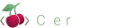

<h1></img></h1>

Cherry is a source-to-source language focused on UI and graphical applications, with the goal of reducing the amount of boilerplate and unnecessary syntax. The compiler is currently built using C# and only builds to the web (via HTML, CSS, and Javascript), but once the self-hosting is built the goal is to enable native applications for Windows and Linux by generating native code projects for each.

### Features
The language is inspired by many different languages, but primarily grew from personal frustration with the standards of C# and HTML. The key features (and their implementation status) are:
- ✔️ Tab indentations decide scope (no spaces, brackets, or semicolons are used for scope)
- ✔️ Built-in UI syntax in the language itself (no XAML, Json or other external file types needed)
- ✔️ Statically typed
- ✔️ Detailed information for every compile error with word highlighting
- ✔️ WEB target
- ✖️ Windows target
- ✖️ Linux target
- ✖️ Top-level statements
- ✖️ Self-hosted (soon)
- ✔️ Automatic re-compile on source update (compiler flag)

### Example
In this example we create a simple centered panel that display "Hello World!" and a counter of how many times a button has been pressed. Note how similar to HTML the UI structure is, but with most of the XML syntax removed and with better automatic resolving of variable value in the text element.

```dart
var number = 0

def increase
	number++

window
	area.panel
		title = "Hello World!"
		text = "Button has been pressed {number} times"
		button onclick:increase = "Click me!"
style
	window
		background-color = #141414
	.panel
		width = 500px
		margin = auto
		padding = 15px
		background-color = #1c1c1c
		color = #c7c7c7
		border-radius = 8px
```
